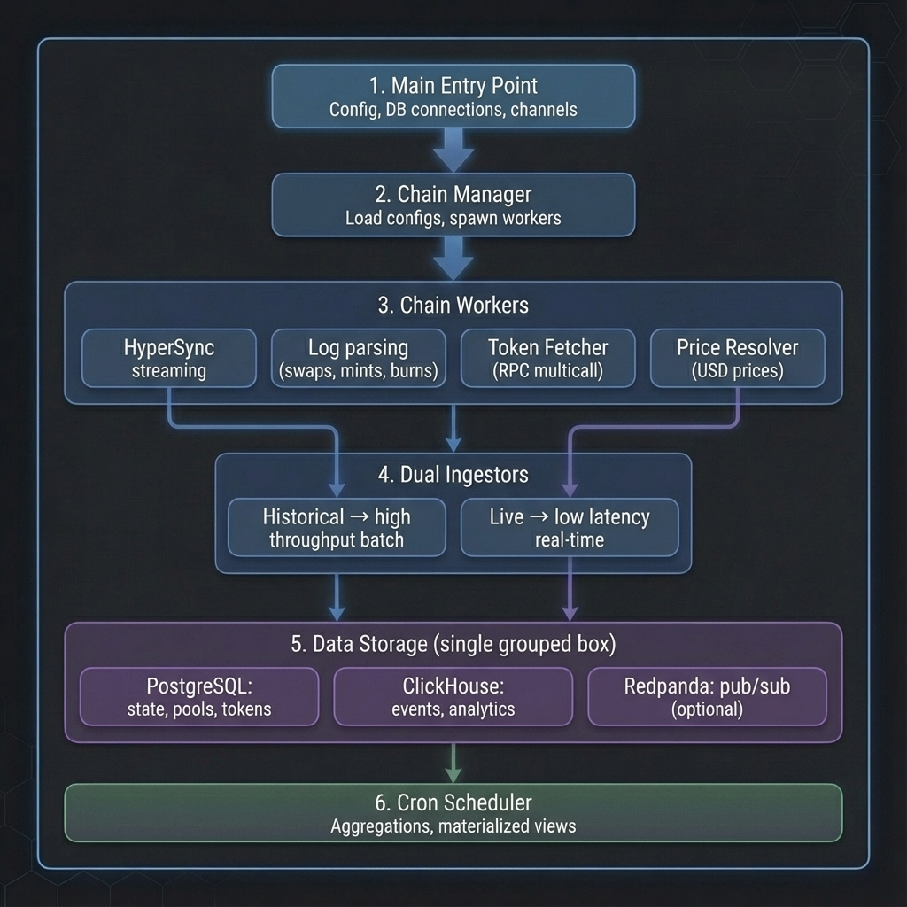

# Runic

A high-performance blockchain indexer built in Rust, designed for indexing DEX activity across multiple EVM-compatible chains. Runic leverages HyperSync for efficient historical data ingestion and provides real-time monitoring through PostgreSQL and Grafana.

---

## Table of Contents

- [Features](#features)
- [Architecture](#architecture)
- [Requirements](#requirements)
- [Configuration](#configuration)
- [Building Locally](#building-locally)
- [Running with Docker](#running-with-docker)
- [Task Commands](#task-commands)
- [Project Structure](#project-structure)
- [License](#license)

---

## Features

- **Multi-chain Support**: Index multiple EVM chains simultaneously
- **High-throughput Ingestion**: Dual-channel architecture for historical and live data
- **DEX Analytics**: Track swaps, liquidity events, and token transfers
- **Price Resolution**: Real-time USD price enrichment for all tokens
- **Grafana Integration**: Pre-configured dashboards for monitoring
- **Graceful Shutdown**: Safe termination with data integrity guarantees

---

## Architecture

### Execution Flow



The indexer operates through a multi-component architecture:

1. **Main Entry Point** - Initializes configuration, database connections, and communication channels
2. **Chain Manager** - Dynamically loads chain configurations and spawns workers
3. **Chain Workers** - Process blockchain data via HyperSync API
4. **Dual Ingestors** - Historical (batch) and Live (real-time) data processing
5. **Cron Scheduler** - Background jobs for aggregations and materialized view updates

### Data Pipeline


Data flows through the system to multiple storage backends:

1. **Ingestion** - HyperSync API provides blockchain events and transactions
2. **Parsing** - Decode logs for swaps, transfers, and liquidity events
3. **Enrichment** - Token metadata via RPC, USD pricing via price resolver
4. **Storage**:
   - **PostgreSQL** - Pool/token state, chain configs, sync checkpoints
   - **ClickHouse** - Events, transfers, snapshots, OHLCV candles
   - **Redpanda** *(optional)* - Real-time pub/sub for live events at chain tip
5. **Aggregation** - Cron jobs compute 24h volumes, price changes, and refresh views

### Database Schemas

For detailed schema documentation, see:
- [ClickHouse Schema](schema/clickhouse.md) - Events, candles, snapshots, transfers
- [PostgreSQL Schema](schema/postgres.md) - Pools, tokens, chains, checkpoints

---

## Requirements

### System Requirements

| Component | Minimum | Recommended |
|-----------|---------|-------------|
| CPU       | 2 cores | 4+ cores    |
| RAM       | 4 GB    | 8+ GB       |
| Storage   | 20 GB   | 100+ GB SSD |

### Software Dependencies

**For Local Development:**

| Dependency | Version | Purpose |
|------------|---------|---------|
| Rust       | 1.75+   | Compilation |
| PostgreSQL | 15+     | State database |
| ClickHouse | 24+     | Analytics database |
| OpenSSL    | 1.1+    | TLS support |

**For Docker Deployment:**

| Dependency      | Version | Purpose |
|-----------------|---------|---------|
| Docker          | 24.0+   | Containerization |
| Docker Compose  | 2.20+   | Service orchestration |
| Task (optional) | 3.0+    | Command automation |

### External Services

| Service | Required | Description |
|---------|----------|-------------|
| HyperSync API | Yes | Blockchain data provider (requires bearer token) |
| RPC Endpoints | Yes | Token metadata resolution (per chain) |
| Redpanda | No | Real-time event streaming (Kafka-compatible) |

---

## Configuration

Create a `config.yaml` file in the project root:

```yaml
clickhouse:
  url: "http://localhost:8123"  # Required: ClickHouse URL
  user: "default"
  password: ""
  database: "indexer"

postgres:
  host: "localhost"  # Use "postgres" for Docker
  port: 5432
  user: "runic"
  password: "your_password"
  database: "indexer"

indexer:
  hypersync_bearer_token: "your_token_here"

# Optional: Real-time pub/sub streaming
redpanda:
  enabled: false
  brokers: "localhost:9092"
  topic_prefix: "runic"
```

### Environment Variables

For Docker deployments, sensitive values can be overridden via environment variables in `docker-compose.yml`.

---

## Building Locally

### 1. Install Dependencies

**macOS:**
```bash
# Install Rust
curl --proto '=https' --tlsv1.2 -sSf https://sh.rustup.rs | sh

# Install PostgreSQL
brew install postgresql@15
```

**Ubuntu/Debian:**
```bash
# Install Rust
curl --proto '=https' --tlsv1.2 -sSf https://sh.rustup.rs | sh

# Install PostgreSQL and build dependencies
sudo apt update
sudo apt install -y postgresql-15 libssl-dev pkg-config
```

### 2. Setup Database

```bash
# Start PostgreSQL service
# macOS: brew services start postgresql@15
# Linux: sudo systemctl start postgresql

# Create database and user
psql -U postgres -c "CREATE USER runic WITH PASSWORD 'your_password';"
psql -U postgres -c "CREATE DATABASE indexer OWNER runic;"

# Initialize schema
psql -U runic -d indexer -f schema/postgres.sql
```

### 3. Build and Run

```bash
# Build release binary
cargo build --release

# Run the indexer
./target/release/runic
```

---

## Running with Docker

Docker provides the simplest deployment method with all services pre-configured.

### Quick Start

```bash
# Build and start all services
docker compose up -d

# View logs
docker compose logs -f runic
```

### Services Overview

| Service    | Port | Description |
|------------|------|-------------|
| postgres   | 5432 | PostgreSQL database |
| clickhouse | 8123 | ClickHouse analytics |
| redpanda   | 9092 | Pub/sub streaming (optional) |
| grafana    | 3000 | Monitoring dashboard |
| runic      | -    | Indexer (no exposed port) |

### Accessing Grafana

Navigate to `http://localhost:3000` and login with:
- **Username:** admin
- **Password:** (see `docker-compose.yml`)

---

## Task Commands

[Task](https://taskfile.dev) provides convenient shortcuts for common operations. Install via:

```bash
# macOS
brew install go-task

# Go
go install github.com/go-task/task/v3/cmd/task@latest
```

### Available Commands

| Command | Description |
|---------|-------------|
| `task`  | Show all available tasks |
| `task up` | Start Docker Compose services |
| `task down` | Stop Docker Compose services |
| `task build` | Build the Docker image |
| `task logs` | Follow container logs |
| `task clean` | Stop services and remove volumes (destructive) |
| `task restart:grafana` | Restart Grafana container |
| `task restart:runic` | Restart Runic indexer container |

### Usage Examples

```bash
# Start the full stack
task up

# Rebuild after code changes
task build && task restart:runic

# View recent logs
task logs

# Full cleanup (removes all data)
task clean
```

---

## Project Structure

```
runic/
├── bin/
│   └── runic.rs           # Application entry point
├── src/
│   ├── abis/              # Contract ABI definitions
│   ├── config/            # Configuration loading
│   ├── cron/              # Background job scheduler
│   ├── db/                # Database layer (PostgreSQL + ClickHouse)
│   ├── pubsub/            # Real-time pub/sub (Redpanda)
│   ├── utils/             # Shared utilities
│   └── worker/            # Chain indexing workers
│       ├── chains.rs      # Chain manager
│       ├── worker.rs      # Chain worker implementation
│       ├── parser.rs      # Event log decoder
│       ├── price_resolver.rs  # USD price resolution
│       └── token_fetcher.rs   # Token metadata fetcher
├── schema/
│   ├── clickhouse.sql     # ClickHouse schema
│   ├── clickhouse.md      # ClickHouse schema documentation
│   ├── postgres.sql       # PostgreSQL schema
│   └── postgres.md        # PostgreSQL schema documentation
├── grafana/
│   ├── provisioning/      # Grafana data sources
│   └── dashboards/        # Pre-built dashboards
├── config.yaml            # Local configuration
├── config.docker.yaml     # Docker configuration
├── docker-compose.yml     # Service definitions
├── Dockerfile             # Multi-stage build
├── Taskfile.yml           # Task automation
├── Cargo.toml             # Rust dependencies
└── Cargo.lock             # Dependency lockfile
```

---

## License

This project is proprietary software. All rights reserved.
